# Conexão Pais — App

> **Ajudando a unir famílias e gerações.**

Versão mobile do portal **Conexão Pais** ([conexaopais.com.br](https://conexaopais.com.br)): artigos, colunas, revista
digital, profissionais parceiros e comunidade para quem cuida, educa e acompanha crianças e adolescentes.

Projeto avaliativo da disciplina de Aplicações Mobile (React Native + API REST + MySQL + JWT), desenvolvido em
4 entregas incrementais.

| Entrega | Conteúdo | Situação |
| --- | --- | --- |
| **1** | Problema, proposta, projeto Expo, telas, navegação e repositório | ✅ Entregue |
| **2** | Modelagem, MySQL, API Express, integração com `fetch()` | ✅ Entregue |
| 3 | JWT, Bearer Token, middleware, níveis no back-end, rotas protegidas e logout | ⏳ Próxima etapa |
| 4 | Testes, correções, README final, APK e apresentação | ⏳ |

---

## 1. Proposta do projeto (Entrega 1)

### 1.1 Problema atual identificado

Quem cuida de crianças e adolescentes tem dúvidas todos os dias: desenvolvimento, sono, escola, telas, limites,
convivência com os avós. Informação existe de sobra, mas está **espalhada, nem sempre é confiável** e muitas vezes
vem cheia de jargão ou de julgamento. Na prática, quem cuida costuma **se sentir sozinho ao decidir**.

> *"Cuidar dá trabalho. Encontrar boa informação não deveria dar."*

> **Pergunta orientadora:** como uma aplicação mobile pode reunir informação confiável, acolhimento e contato com
> profissionais em um só lugar para quem cuida?

### 1.2 Contexto e público afetado

- **Público principal:** pais, mães, avós e outros responsáveis, em todas as configurações de família.
- **Profissionais parceiros:** psicólogos, pediatras, pedagogos, terapeutas familiares e outras pessoas que
  atendem famílias e querem publicar conteúdo de qualidade.
- **Afetados indiretamente:** crianças e adolescentes, que ganham adultos mais bem informados e mais tranquilos
  para conversar.

O projeto já existe como portal web (site Conexão Pais). O app leva esse ecossistema para o celular, que é onde a
dúvida aparece: no carro, na fila da escola, na hora de dormir.

### 1.3 Justificativa

- **Credibilidade:** o conteúdo é escrito e revisado por profissionais, com autoria visível.
- **Acolhimento:** linguagem clara, sem jargão e sem julgamento, pensada para diferentes arranjos familiares.
- **Rede de apoio:** a comunidade (curtir, salvar, comentar, perguntar à equipe) e o diretório de profissionais
  verificados mostram que ninguém precisa cuidar sozinho.
- **Segurança:** só profissionais com registro conferido pela administração podem publicar.
- **Por que um app:** consulta rápida no momento da dúvida, conteúdos salvos sempre à mão e, futuramente, avisos
  de novas colunas e edições da revista.
- **ODS 4 (Educação de Qualidade):** educação não formal e aprendizagem ao longo da vida para famílias.

### 1.4 Proposta de solução

O **app Conexão Pais** reúne, no celular, as seções do portal:

1. **Conteúdos:** artigos, colunas assinadas e a revista digital (leitura página a página).
2. **Profissionais:** diretório com especialidade, cidade, forma de atendimento e contato por WhatsApp.
3. **Comunidade:** curtidas, conteúdos salvos, comentários nos artigos, perguntas à equipe e regras de convivência.
4. **Área de publicação:** profissionais aprovados e a administração publicam, editam e excluem artigos.
5. **Administração:** verificação de novos profissionais (aprovar, pedir ajustes ou recusar) e moderação.

A **entidade principal** é a **Publicação (artigo)**. É ela que terá CRUD completo integrado à API e ao MySQL nas
próximas entregas, assim como a tabela `publicacoes` do site.

**Arquitetura da solução** (construída ao longo das 4 entregas):

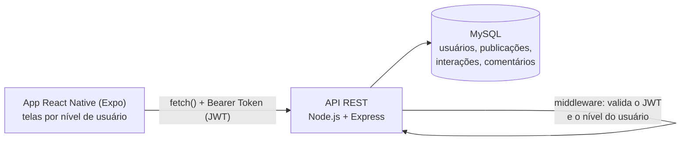
```mermaid
flowchart LR
    APP["App React Native (Expo)<br/>telas por nível de usuário"] -->|"fetch() + Bearer Token (JWT)"| API["API REST<br/>Node.js + Express"]
    API -->|"middleware: valida o JWT<br/>e o nível do usuário"| API
    API --> DB[("MySQL<br/>usuários, publicações,<br/>interações, comentários")]
```

Situação atual: telas, navegação e regras de acesso por nível (Entrega 1); API Express + MySQL integrados ao app
com `fetch()` (Entrega 2). O token JWT e a proteção das rotas por nível entram na Entrega 3.

### 1.5 Nome da aplicação

**Conexão Pais**, o mesmo nome do portal, com o slogan *"Ajudando a unir famílias e gerações."*

### 1.6 Tipos de usuário

Os níveis são os mesmos do site (`app_role`):

| Tipo | Nível | Quem é |
| --- | --- | --- |
| **Visitante** | — | Pessoa ainda não autenticada |
| **Família** | `usuario` | Pai, mãe, avó/avô ou outro responsável |
| **Profissional** | `profissional` | Profissional parceiro. Começa **em verificação** e só publica depois de **aprovado** pela administração |
| **Administração** | `admin` | Equipe do Conexão Pais (curadoria, moderação e verificação) |

Situações do cadastro profissional: `pendente` → `aprovado`, `ajustes_solicitados` ou `recusado`.

### 1.7 Permissões iniciais

| Ação | Visitante | Família | Profissional em verificação | Profissional aprovado | Admin |
| --- | :---: | :---: | :---: | :---: | :---: |
| Ver boas-vindas, entrar e criar conta | ✅ | — | — | — | — |
| Ler artigos, colunas e revista | ❌ | ✅ | ✅ | ✅ | ✅ |
| Ver profissionais e chamar no WhatsApp | ❌ | ✅ | ✅ | ✅ | ✅ |
| Curtir, salvar e comentar | ❌ | ✅ | ✅ | ✅ | ✅ |
| Excluir o próprio comentário | ❌ | ✅ | ✅ | ✅ | ✅ |
| Publicar artigo | ❌ | ❌ | ❌ | ✅ | ✅ |
| Editar e excluir artigo | ❌ | ❌ | ❌ | só os próprios | todos |
| Excluir comentário de outra pessoa | ❌ | ❌ | ❌ | ❌ | ✅ |
| Aprovar, pedir ajustes ou recusar profissionais | ❌ | ❌ | ❌ | ❌ | ✅ |

São as mesmas regras do banco do site (políticas da tabela `publicacoes`: *"Admin e profissional aprovado
criam"*, *"Autor ou admin edita"*, *"Autor ou admin remove"*). Na Entrega 3 elas serão garantidas **no back-end**
por middleware de autenticação (JWT enviado como Bearer Token) e de autorização por nível.

### 1.8 Principais funcionalidades

1. Cadastro com tipo de conta (família ou profissional, com profissão e número de registro) e login.
2. Início com destaques: artigo em destaque, revista atual, profissionais, colunas e "Como funciona".
3. Artigos com busca e filtro por categoria; leitura com curtir, salvar e comentários.
4. Colunas assinadas e revista digital com leitor página a página.
5. Diretório de profissionais com busca, filtro por especialidade e contato por WhatsApp.
6. Comunidade: conversas em andamento, destaques (mais curtidos e mais salvos), pergunta à equipe e regras.
7. Minha conta: dados e nível do usuário, situação do cadastro profissional, conteúdos salvos e logout.
8. Área de publicação: criar, editar e excluir artigos, conforme o nível.
9. Administração: verificação de novos profissionais.
10. Sobre (valores, história e equipe) e Contato.

### 1.9 Telas previstas

Todas as telas abaixo existem no app. A seção 2.2 mostra quais rotas da API cada uma usa.

| # | Tela | Acesso | Descrição |
| --- | --- | --- | --- |
| 1 | Boas-vindas | Visitante | Apresentação, foto da família e acesso a Entrar / Criar conta |
| 2 | Entrar | Visitante | E-mail e senha (+ perfis de demonstração) |
| 3 | Criar conta | Visitante | Nome, e-mail, tipo de conta, profissão/registro (profissional) e senha |
| 4 | Início | Logado | Saudação, destaques e atalhos |
| 5 | Conteúdos | Logado | Artigos (busca e categorias), Colunas e Revista |
| 6 | Artigo | Logado | Leitura, curtir, salvar, comentários e conteúdos relacionados |
| 7 | Coluna | Logado | Apresentação da coluna e publicações |
| 8 | Revista | Logado | Capa, destaques e leitor página a página |
| 9 | Profissionais | Logado | Diretório com busca e filtro por especialidade |
| 10 | Perfil profissional | Logado | Dados, contato por WhatsApp, conteúdos e colunas |
| 11 | Comunidade | Logado | Recursos, conversas, destaques, pergunta à equipe e regras |
| 12 | Minha conta | Logado | Perfil, nível, salvos, publicações e administração |
| 13 | Sobre | Logado | Valores, como surgiu e equipe |
| 14 | Contato | Logado | Formulário de mensagem para a equipe |
| 15 | Nova postagem / Editar artigo | Profissional aprovado e admin | Formulário do artigo |
| 16 | Novos profissionais | Somente admin | Aprovar, pedir ajustes ou recusar cadastros |

### 1.10 Fluxo inicial de navegação

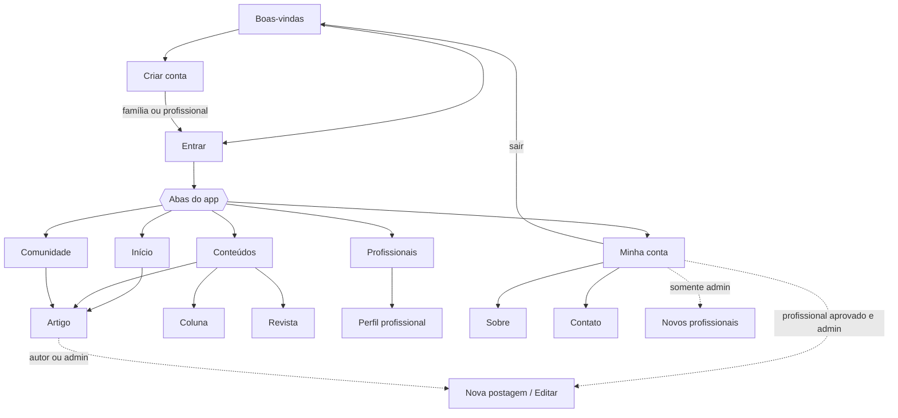
```mermaid
flowchart TD
    W[Boas-vindas] --> L[Entrar]
    W --> C[Criar conta]
    C -->|família ou profissional| L
    L --> T{{Abas do app}}

    T --> H[Início]
    T --> CT[Conteúdos]
    T --> P[Profissionais]
    T --> CM[Comunidade]
    T --> MC[Minha conta]

    H --> A[Artigo]
    CT --> A
    CT --> CO[Coluna]
    CT --> R[Revista]
    P --> PP[Perfil profissional]
    CM --> A
    MC --> S[Sobre]
    MC --> CTT[Contato]
    MC -->|sair| W

    MC -.->|profissional aprovado e admin| NP[Nova postagem / Editar]
    A -.->|autor ou admin| NP
    MC -.->|somente admin| NV[Novos profissionais]
```

**Como a navegação está organizada (React Navigation):**

- **Stack raiz** (`native-stack`): mostra só as telas públicas quando não há usuário logado. Depois do login,
  registra as telas de leitura e, **conforme o nível**, a área de publicação (`canPublish`) e a verificação de
  profissionais (`isAdmin`). Uma tela que não foi registrada não pode ser aberta.
- **Abas inferiores** (`bottom-tabs`): Início, Conteúdos, Profissionais, Comunidade e Minha conta.
- **Telas empilhadas sobre as abas:** Artigo, Coluna, Revista, Perfil profissional, Sobre, Contato, Nova postagem e
  Novos profissionais.

---

## 2. Planejamento técnico e integração (Entrega 2)

### 2.1 Requisitos funcionais atualizados

| # | Requisito | Situação |
| --- | --- | --- |
| RF01 | Criar conta de família ou profissional (profissão e registro), com senha salva em hash | ✅ API + banco |
| RF02 | Entrar com e-mail e senha conferidos pela API | ✅ API + banco · JWT na Entrega 3 |
| RF03 | Sair da conta | ✅ · descartar o token na Entrega 3 |
| RF04 | Listar artigos e buscar por termo e categoria | ✅ API + banco |
| RF05 | Ler o artigo completo | ✅ API + banco |
| RF06 | Publicar artigo (só profissional aprovado ou admin) | ✅ API confere o nível do autor |
| RF07 | Editar e excluir artigo (autor ou admin) | ✅ no app · conferência no back-end na Entrega 3 |
| RF08 | Curtir e salvar artigos; ver os salvos em Minha conta | ✅ API + banco |
| RF09 | Comentar e excluir o próprio comentário | ✅ API + banco |
| RF10 | Ver colunas e suas publicações | ✅ API + banco |
| RF11 | Ler a revista digital página a página | ✅ API + banco |
| RF12 | Buscar profissionais e ver o perfil com artigos e colunas | ✅ API + banco |
| RF13 | Enviar mensagem de contato e pergunta à equipe | ✅ API + banco |
| RF14 | Aprovar, pedir ajustes ou recusar cadastros profissionais (admin) | ✅ API + banco · restrito ao admin na Entrega 3 |
| RF15 | Proteger as rotas com token JWT e nível de usuário | ⏳ Entrega 3 |

**Requisitos não funcionais já atendidos:** senha nunca é salva em texto (bcrypt); validação dos dados no app **e**
na API; consultas SQL com parâmetros (`?`), que evitam SQL injection; respostas de erro padronizadas
(`{ erro, campos }`) exibidas nas telas; credenciais do banco fora do repositório (`.env`).

### 2.2 Telas e fluxos atualizados

As telas e a navegação continuam as da seção 1.10. O que mudou é a origem dos dados: agora tudo vem da API.

| Tela | Rotas da API usadas |
| --- | --- |
| Entrar | `POST /api/auth/login` |
| Criar conta | `POST /api/usuarios` |
| Início | `GET /api/artigos`, `GET /api/revistas`, `GET /api/profissionais`, `GET /api/colunas` |
| Conteúdos | `GET /api/artigos?busca=&categoria=`, `GET /api/categorias`, `GET /api/colunas`, `GET /api/revistas` |
| Artigo | `GET /api/artigos/:id`, `GET` e `POST /api/artigos/:id/comentarios`, `DELETE /api/comentarios/:id`, `POST /api/artigos/:id/interacoes`, `DELETE /api/artigos/:id` |
| Coluna | `GET /api/colunas/:slug` |
| Revista | `GET /api/revistas/:slug` |
| Profissionais / Perfil profissional | `GET /api/profissionais`, `GET /api/profissionais/:slug` |
| Comunidade | `GET /api/artigos`, `POST /api/artigos/:id/interacoes`, `POST /api/mensagens` |
| Minha conta | `GET /api/usuarios/:id`, `GET /api/usuarios/:id/interacoes`, `DELETE /api/artigos/:id`; admin: `GET /api/usuarios?nivel=profissional&verificacao=pendente` |
| Nova postagem / Editar artigo | `POST /api/artigos`, `GET` e `PUT /api/artigos/:id`, `GET /api/categorias` |
| Novos profissionais | `GET /api/usuarios?nivel=profissional`, `PATCH /api/usuarios/:id/verificacao` |
| Contato | `POST /api/mensagens` |

**Caminho de uma requisição** (exemplo: publicar um artigo):

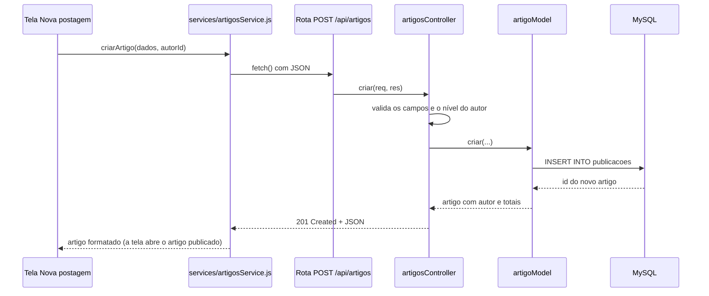
```mermaid
sequenceDiagram
    participant T as Tela Nova postagem
    participant S as services/artigosService.js
    participant R as Rota POST /api/artigos
    participant C as artigosController
    participant M as artigoModel
    participant DB as MySQL
    T->>S: criarArtigo(dados, autorId)
    S->>R: fetch() com JSON
    R->>C: criar(req, res)
    C->>C: valida os campos e o nível do autor
    C->>M: criar(...)
    M->>DB: INSERT INTO publicacoes
    DB-->>M: id do novo artigo
    M-->>C: artigo com autor e totais
    C-->>S: 201 Created + JSON
    S-->>T: artigo formatado (a tela abre o artigo publicado)
```

Se algo der errado, a API responde com o status adequado (400, 403, 404, 409, 503) e uma mensagem. A tela mostra
essa mensagem e, nos formulários, o erro aparece embaixo do campo correspondente.

### 2.3 Estrutura do banco de dados

Banco **`conexao_pais`** no MySQL, com 10 tabelas. Scripts: [`database/schema.sql`](database/schema.sql) (estrutura)
e [`database/seed.sql`](database/seed.sql) (conteúdo do site, contas de demonstração e interações iniciais).

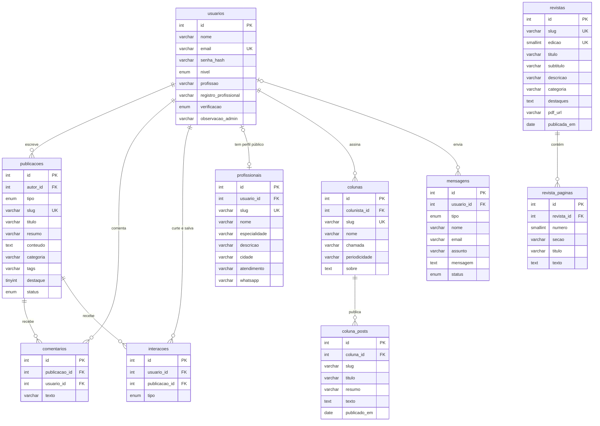
```mermaid
erDiagram
    usuarios ||--o{ publicacoes : "escreve"
    usuarios ||--o{ comentarios : "comenta"
    usuarios ||--o{ interacoes : "curte e salva"
    publicacoes ||--o{ comentarios : "recebe"
    publicacoes ||--o{ interacoes : "recebe"
    usuarios |o--o| profissionais : "tem perfil público"
    usuarios ||--o{ colunas : "assina"
    colunas ||--o{ coluna_posts : "publica"
    revistas ||--o{ revista_paginas : "contém"
    usuarios |o--o{ mensagens : "envia"

    usuarios {
        int id PK
        varchar nome
        varchar email UK
        varchar senha_hash
        enum nivel
        varchar profissao
        varchar registro_profissional
        enum verificacao
        varchar observacao_admin
    }
    publicacoes {
        int id PK
        int autor_id FK
        enum tipo
        varchar slug UK
        varchar titulo
        varchar resumo
        text conteudo
        varchar categoria
        varchar tags
        tinyint destaque
        enum status
    }
    comentarios {
        int id PK
        int publicacao_id FK
        int usuario_id FK
        varchar texto
    }
    interacoes {
        int id PK
        int usuario_id FK
        int publicacao_id FK
        enum tipo
    }
    profissionais {
        int id PK
        int usuario_id FK
        varchar slug UK
        varchar nome
        varchar especialidade
        varchar descricao
        varchar cidade
        varchar atendimento
        varchar whatsapp
    }
    colunas {
        int id PK
        int colunista_id FK
        varchar slug UK
        varchar nome
        varchar chamada
        varchar periodicidade
        text sobre
    }
    coluna_posts {
        int id PK
        int coluna_id FK
        varchar slug
        varchar titulo
        varchar resumo
        text texto
        date publicado_em
    }
    revistas {
        int id PK
        varchar slug UK
        smallint edicao UK
        varchar titulo
        varchar subtitulo
        varchar descricao
        varchar categoria
        text destaques
        varchar pdf_url
        date publicada_em
    }
    revista_paginas {
        int id PK
        int revista_id FK
        smallint numero
        varchar secao
        varchar titulo
        text texto
    }
    mensagens {
        int id PK
        int usuario_id FK
        enum tipo
        varchar nome
        varchar email
        varchar assunto
        text mensagem
        enum status
    }
```

Decisões de modelagem:

- **`publicacoes` é a entidade principal**, com o mesmo nome e os mesmos campos da tabela do site. O campo `tipo`
  deixa espaço para os posts curtos da comunidade.
- **Um único `usuarios` para os três níveis** (`nivel`). A situação do cadastro profissional fica em `verificacao`,
  e só `profissional` aprovado ou `admin` pode publicar (regra conferida pela API).
- **`profissionais` é separado de `usuarios`**: o diretório mostra o perfil público, e a conta guarda o login.
  O vínculo (`usuario_id`) liga o perfil aos artigos e colunas da pessoa.
- **`interacoes` tem chave única (usuário + artigo + tipo)**: ninguém curte ou salva o mesmo artigo duas vezes.
- **Exclusões em cascata**: ao excluir um artigo, os comentários e as interações dele também saem.

### 2.4 Entidades e campos

| Entidade (tabela) | Campos principais | Relacionamentos |
| --- | --- | --- |
| Usuário (`usuarios`) | nome, e-mail (único), senha_hash, nível, profissão, registro, verificação | escreve publicações, comenta, curte/salva, assina colunas |
| **Publicação (`publicacoes`)** | autor, título, slug (único), resumo, conteúdo, categoria, tags, destaque, status | pertence a um usuário; tem comentários e interações |
| Comentário (`comentarios`) | publicação, usuário, texto, data | pertence a uma publicação e a um usuário |
| Interação (`interacoes`) | usuário, publicação, tipo (curtida/salvo) | une usuário e publicação |
| Profissional (`profissionais`) | slug, nome, especialidade, descrição, cidade, atendimento, WhatsApp | ligado (opcionalmente) a um usuário |
| Coluna (`colunas`) | colunista, slug, nome, chamada, periodicidade, sobre | tem várias publicações da coluna |
| Publicação da coluna (`coluna_posts`) | coluna, slug, título, resumo, texto, data | pertence a uma coluna |
| Revista (`revistas`) | edição (única), título, subtítulo, descrição, categoria, destaques, PDF, data | tem várias páginas |
| Página da revista (`revista_paginas`) | revista, número, seção, título, texto | pertence a uma edição |
| Mensagem (`mensagens`) | tipo (contato/pergunta), nome, e-mail, assunto, mensagem, status | enviada (opcionalmente) por um usuário |

O tipo, o tamanho, as chaves e a regra de exclusão de **cada campo** estão no dicionário de dados:
[`docs/banco-de-dados.md`](docs/banco-de-dados.md).

### 2.5 Principais rotas da API

Base: `http://localhost:3333/api`. Corpo e respostas em JSON. Exemplos prontos para testar estão em
[`api/requests.http`](api/requests.http).

| Método | Rota | O que faz |
| --- | --- | --- |
| GET | `/status` | Confere se a API e o banco estão respondendo |
| POST | `/auth/login` | Confere e-mail e senha e devolve o usuário |
| POST | `/usuarios` | Cria conta (família ou profissional) |
| GET | `/usuarios?nivel=&verificacao=` | Lista contas (ex.: profissionais pendentes) |
| GET | `/usuarios/:id` | Dados de uma conta |
| GET | `/usuarios/:id/interacoes` | Curtidas e salvos da conta |
| PATCH | `/usuarios/:id/verificacao` | Aprova, pede ajustes ou recusa um cadastro profissional |
| GET | `/artigos?busca=&categoria=&autorId=` | **Lista artigos** (com autor e totais) |
| GET | `/artigos/:id` | **Artigo completo** |
| POST | `/artigos` | **Publica artigo** (201) |
| PUT | `/artigos/:id` | **Edita artigo** |
| DELETE | `/artigos/:id` | **Exclui artigo** (204) |
| GET | `/categorias` | Categorias com artigos publicados |
| GET / POST | `/artigos/:id/comentarios` | Lista / cria comentários |
| DELETE | `/comentarios/:id` | Exclui comentário |
| POST | `/artigos/:id/interacoes` | Liga/desliga curtida ou salvo e devolve o total |
| GET | `/profissionais`, `/profissionais/:slug` | Diretório e perfil (com artigos e colunas) |
| GET | `/colunas`, `/colunas/:slug` | Colunas e publicações |
| GET | `/revistas`, `/revistas/:slug` | Edições e páginas |
| POST | `/mensagens` | Contato ou pergunta à equipe |

Organização do código da API (`api/src`): **routes** (endereços) → **controllers** (validação, regras e resposta HTTP)
→ **models** (SQL) → **config/database.js** (pool de conexões com o MySQL). Erros passam por um middleware central.

### 2.6 Níveis de usuário e permissões previstas na API

| Rotas | Quem poderá usar (Entrega 3, com JWT) |
| --- | --- |
| `GET /status`, `POST /auth/login`, `POST /usuarios` | Qualquer pessoa |
| `GET` de artigos, categorias, comentários, profissionais, colunas e revistas | Usuário logado |
| `POST /artigos/:id/comentarios`, `POST /artigos/:id/interacoes`, `POST /mensagens` | Usuário logado (o id sai do token) |
| `GET /usuarios/:id`, `GET /usuarios/:id/interacoes` | O próprio usuário ou admin |
| `POST /artigos` | Profissional aprovado ou admin |
| `PUT /artigos/:id`, `DELETE /artigos/:id` | Autor do artigo ou admin |
| `DELETE /comentarios/:id` | Autor do comentário ou admin |
| `GET /usuarios`, `PATCH /usuarios/:id/verificacao` | Somente admin |

**Já nesta entrega**, a API confere a senha (bcrypt), impede e-mail repetido, valida todos os campos e só deixa
publicar quem é profissional aprovado ou admin. O que fica para a Entrega 3: hoje o app informa quem é o usuário
no corpo da requisição (`autorId`, `usuarioId`). Com o JWT, essa identidade passa a vir do token enviado como
Bearer Token, e um middleware vai bloquear as rotas conforme a tabela acima.

---

## 3. Versão atual do app

| Boas-vindas | Início | Conteúdos | Artigo |
| --- | --- | --- | --- |
|  |  | 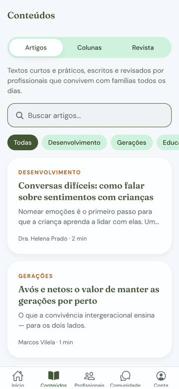 | 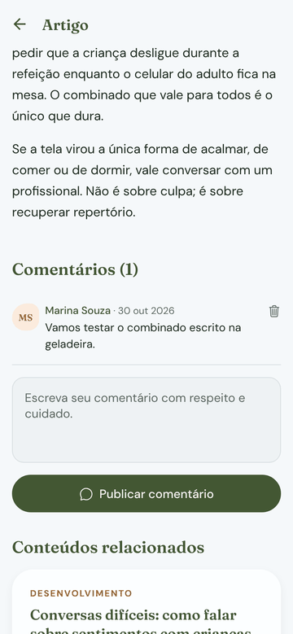 |

| Revista | Perfil profissional | Comunidade | Minha conta |
| --- | --- | --- | --- |
| 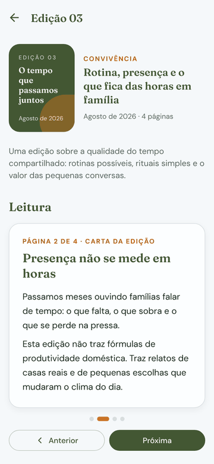 |  | 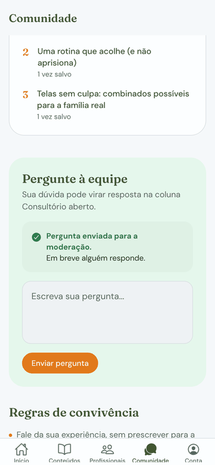 | 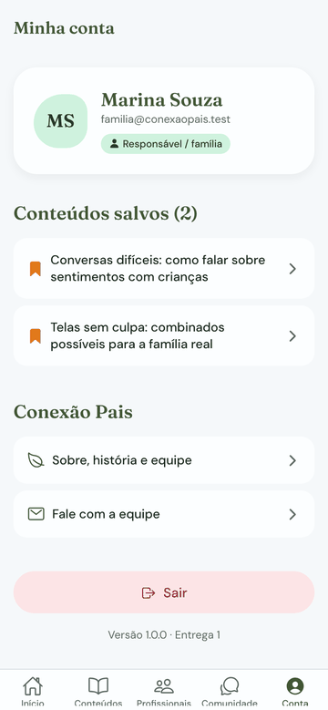 |

| Criar conta (profissional) | Novos profissionais (admin) | Nova postagem | Artigo publicado |
| --- | --- | --- | --- |
| 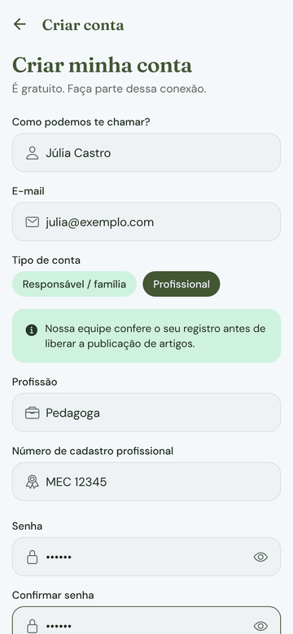 | 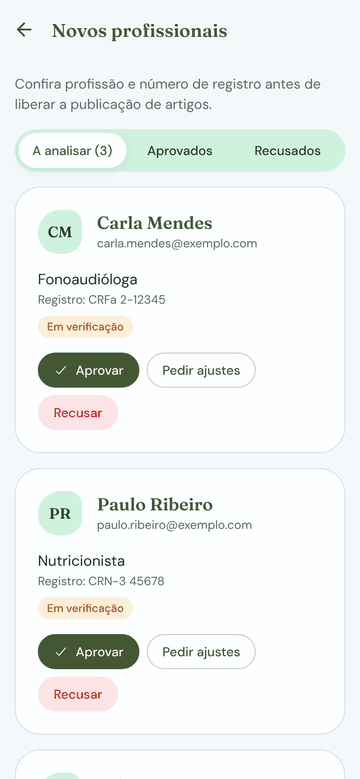 | 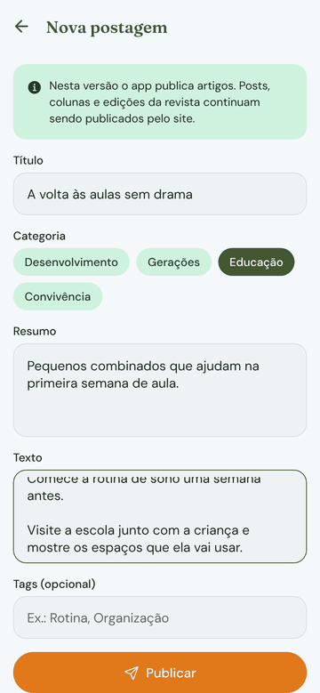 | 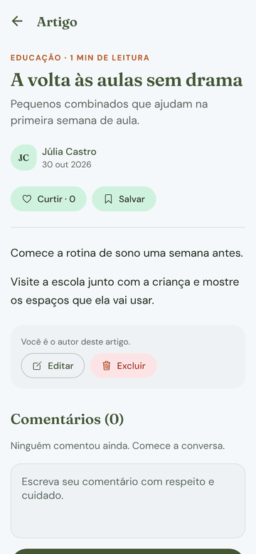 |

**O que já funciona:**

- 16 telas com React Navigation 7 (stack raiz + abas inferiores) e a identidade visual do site;
- telas e ações diferentes para cada nível (família, profissional em verificação, profissional aprovado e admin);
- **todos os dados vêm do MySQL pela API**, com `fetch()`: cadastro, login, artigos (CRUD completo), comentários,
  curtidas, salvos, colunas, revista, profissionais, mensagens e verificação de profissionais;
- estados de carregamento e de erro em todas as telas, com opção de tentar de novo;
- validação nos formulários e na API, com os erros da API mostrados no campo certo.

**Próxima etapa (Entrega 3):** a sessão ainda fica só na memória do app. Com o JWT, o token será guardado no
aparelho, enviado como Bearer Token e conferido pela API em cada rota protegida.

### Contas de demonstração

Criadas pelo `database/seed.sql`. Na tela **Entrar**, os botões do *Modo demonstração* preenchem estas contas:

| Perfil | E-mail | Senha |
| --- | --- | --- |
| Família | `familia@conexaopais.test` | `123456` |
| Profissional aprovado (Dra. Helena Prado) | `profissional@conexaopais.test` | `123456` |
| Administração | `admin@conexaopais.test` | `123456` |

Os autores dos outros artigos e colunas também têm conta (`marcos@`, `bianca@` e `rafael@conexaopais.test`, mesma
senha), e há dois cadastros profissionais de exemplo aguardando a análise da administração.

Para ver o fluxo completo de níveis: crie uma conta **Profissional**, entre com ela (fica em verificação), entre
como **Administração** e aprove o cadastro em *Minha conta → Novos profissionais*, depois entre de novo com a conta
profissional e publique um artigo.

---

## 4. Tecnologias

| Camada | Tecnologia |
| --- | --- |
| App | React Native 0.88 + Expo SDK 58 (JavaScript) |
| Navegação | React Navigation 7 (`native-stack` e `bottom-tabs`) |
| Comunicação | `fetch()` com JSON (camada `src/services`) e `expo-constants` para achar o IP da API |
| Visual | `@expo/vector-icons` (Ionicons), `expo-font` com Fraunces e DM Sans (`@expo-google-fonts`) |
| Estado | React Context (autenticação, artigos, comunidade, confirmação) e hook `useApi` |
| API | Node.js 20+ e Express 5 (`cors`, `dotenv`) |
| Banco | MySQL 8 (ou MariaDB 10.6+) com `mysql2` (pool de conexões e consultas parametrizadas) |
| Senhas | `bcryptjs` (hash) |
| Autenticação (Entrega 3) | JWT enviado como Bearer Token |

## 5. Estrutura do repositório

```
conexaopais.app/
├── README.md
├── database/
│   ├── schema.sql            # cria o banco conexao_pais e as 10 tabelas
│   └── seed.sql              # conteúdo do site, contas de demonstração e interações
├── api/                      # API REST (Node.js + Express)
│   ├── .env.example          # modelo de configuração (o .env real não vai para o Git)
│   ├── requests.http         # exemplos de requisições para testar as rotas
│   ├── scripts/setup-db.js   # npm run db:setup: executa schema.sql + seed.sql
│   └── src/
│       ├── server.js         # sobe o servidor na porta 3333
│       ├── app.js            # Express, CORS, JSON, rotas e tratamento de erros
│       ├── config/           # conexão com o MySQL (pool)
│       ├── routes/           # endereços da API (um arquivo por recurso)
│       ├── controllers/      # validação, regras e respostas HTTP
│       ├── models/           # consultas SQL
│       ├── middlewares/      # rota não encontrada e erros
│       └── utils/            # validação e funções de texto
├── docs/
│   ├── banco-de-dados.md     # dicionário de dados (todos os campos)
│   └── telas/                # imagens das telas usadas neste README
└── mobile/                   # aplicativo React Native (Expo)
    ├── App.js                # fontes, provedores de contexto e NavigationContainer
    ├── app.json              # nome, ícone, splash e pacote Android (app.conexaopais)
    ├── .env.example          # EXPO_PUBLIC_API_URL (opcional)
    ├── assets/               # logo da árvore, ícones, splash e fotos do site
    └── src/
        ├── services/         # api.js (fetch) e serviços por recurso + formatadores
        ├── hooks/            # useApi (carregando / erro / recarregar)
        ├── components/       # Button, TextField, ArticleCard, AsyncState...
        ├── contexts/         # AuthContext, ContentContext (CRUD de artigos), CommunityContext...
        ├── data/             # textos institucionais fixos (Sobre e Comunidade)
        ├── navigation/       # RootNavigator (stack por nível), AppTabs (abas) e tema
        ├── screens/          # auth/, app/, publish/ e admin/
        ├── theme/            # cores, fontes, espaçamentos e estilos de texto do site
        └── utils/            # validações e funções de texto
```

## 6. Como executar

Pré-requisitos: [Node.js](https://nodejs.org) 20 ou superior, **MySQL 8** (ou MariaDB 10.6+, como no XAMPP) e o app
**Expo Go** no celular. O celular e o computador precisam estar **na mesma rede Wi-Fi**.

### 6.1 Banco de dados e API

```bash
cd api
npm install
```

Copie `api/.env.example` para `api/.env` e coloque o usuário e a senha do seu MySQL. Depois crie o banco com os
dados iniciais (isso executa `database/schema.sql` e `database/seed.sql`):

```bash
npm run db:setup
```

> Também dá para rodar os dois arquivos `.sql` no MySQL Workbench, nessa ordem.

Suba a API (ela reinicia sozinha quando o código muda):

```bash
npm run dev
```

Teste no navegador: <http://localhost:3333/api/status> deve mostrar `{"api":"ok","banco":"ok"}`.

### 6.2 App

Em outro terminal:

```bash
cd mobile
npm install
npx expo start
```

Leia o QR Code com o Expo Go. O app encontra a API sozinho, usando o IP do computador que está rodando o Expo, na
porta 3333. Se o app mostrar *"Não foi possível conectar à API"*:

- confira se a API está rodando e se o celular está no mesmo Wi-Fi;
- libere a porta **3333** no firewall do computador (no Windows, permita o Node.js em redes privadas);
- ou informe o endereço manualmente: crie `mobile/.env` com `EXPO_PUBLIC_API_URL=http://IP_DO_COMPUTADOR:3333/api`
  e reinicie com `npx expo start -c`.

No navegador do computador: `npx expo start --web`.

---

## 7. Próximas entregas

- **Entrega 3:** login devolvendo JWT, token guardado no aparelho e enviado como Bearer Token, middleware de
  autenticação e de nível, rotas protegidas conforme a seção 2.6 e logout.
- **Entrega 4:** testes, correções, README final, APK e apresentação.

## Autoria

Desenvolvido por **Ana Elisa Sprenger** ([@anasprenger](https://github.com/anasprenger)).
